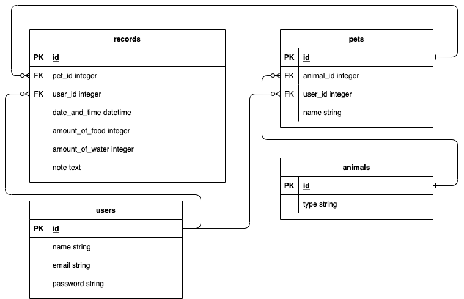

## アプリケーション名
ペット管理App

## このアプリケーションを開発した背景
Progateの「Web開発コース(Ruby on Rails)」の最終課題である、「Webアプリ開発に挑戦してみよう」用にローカル環境でアプリケーションを開発いたしました。

## このアプリケーションの概要
私は猫が好きです。なので、ペットの食事管理ができるようなアプリケーションを作成いたしました。  
作成したテーブルは、最後のER図をご覧ください。  
※HTMLとCSSはプロゲートの課題のコードを流用しております。

## 今回の学習で学んだこと
今回学んだことは3点ございます、
- form_withメソッドでの国際化
- `find_by`と`find`の違い
- アソシエーションのやり方を、プロゲートで学習した内容で取り組んだ

### form_withメソッドでの国際化
```
<%= form_with(model: @user, local: true) do |from| %>
```
のように、`model: @user`としないと、`<%= form.label :name %>`と記述をしても、日本語に変換されない。日本語に変換をするには、
```
<%= f.label :last_name, User.human_attribute_name(:name) %>
```
のように記述をする必要がある。

### `find_by`と`find`の違い
```
@pet = Pet.find_by(id: params[:id])
```
では、nilの時に@petにnilが代入される。
```
@pet = Pet.find(params[:id])
```
では、nil時にはエラーが発生する。

### アソシエーションのやり方を、プロゲートで学習した内容で取り組んだ
プロゲートでは、アソシエーションのメソッドを利用していませんでした。それに倣い、コードへの理解を深めるために、下記2点のようなアソシエーション用のコードを記述いたしました。
- アソシエーションで利用できるメソッド部分は自作し、メソッド内で行われているであろう処理を考えました。  
- また、ユーザーを削除した場合に、ユーザーに紐付いている全てのデータが削除される部分も、アソシエーションのメソッドを利用せず、記述をいたしました。

user.rb
```
def pets
  return Pet.where(user_id: self.id)
end
```


users.controller.rb
```
def destroy
  @user.destroy
  @user.pets.delete_all
  Record.where(user_id: @user.id).delete_all

  flash[:notice] = "アカウントを削除しました"
  redirect_to("/")
end
```

## 開発環境
- macOS Monterey 12.6
- Ruby 3.1.4
- Rails 7.0.7

## 実行手順
```
$ git clone git@github.com:DaisukeKurita/pet_management.git 
$ cd pet_management
$ bundle install
$ rails db:create db:migrate
$ rails db:seed
$ rails s
```

## ER図
  
